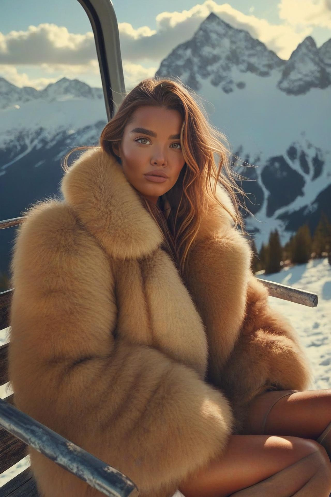
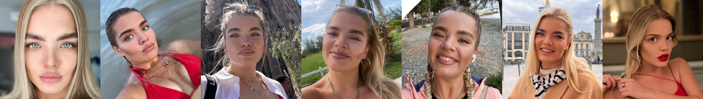
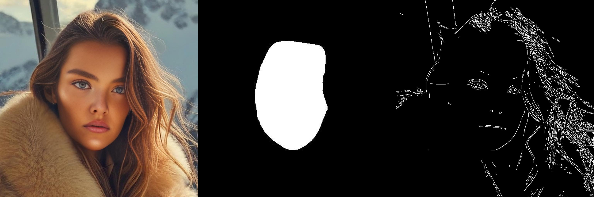
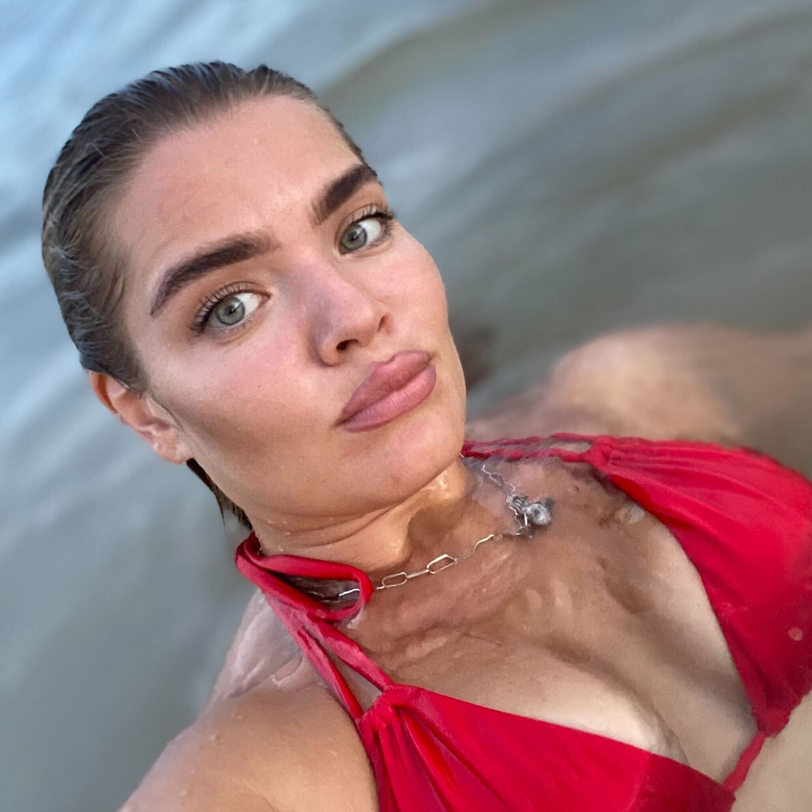
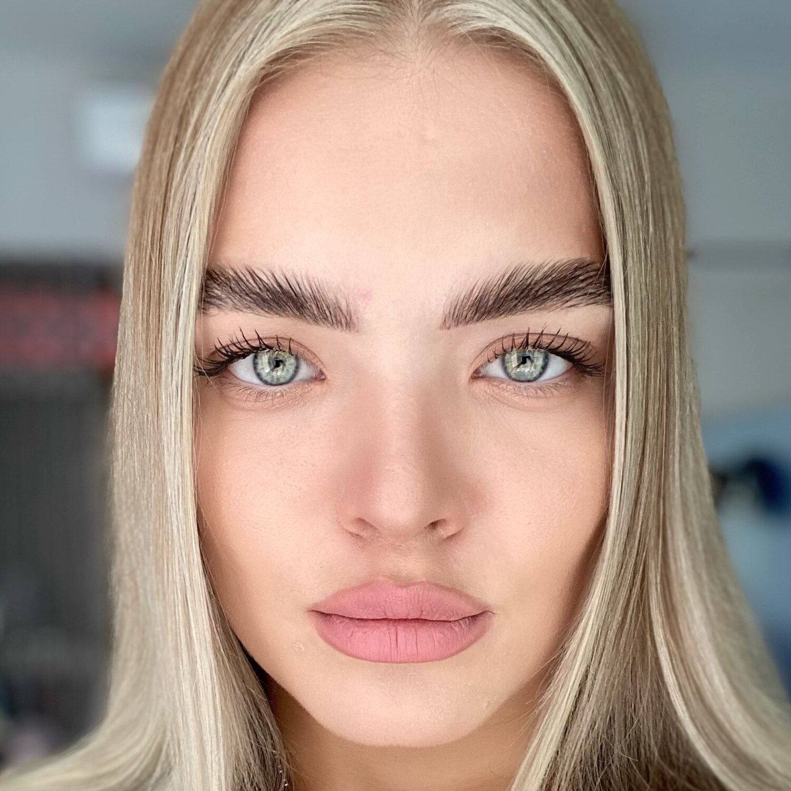
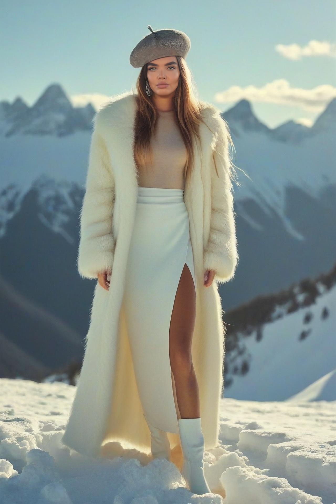
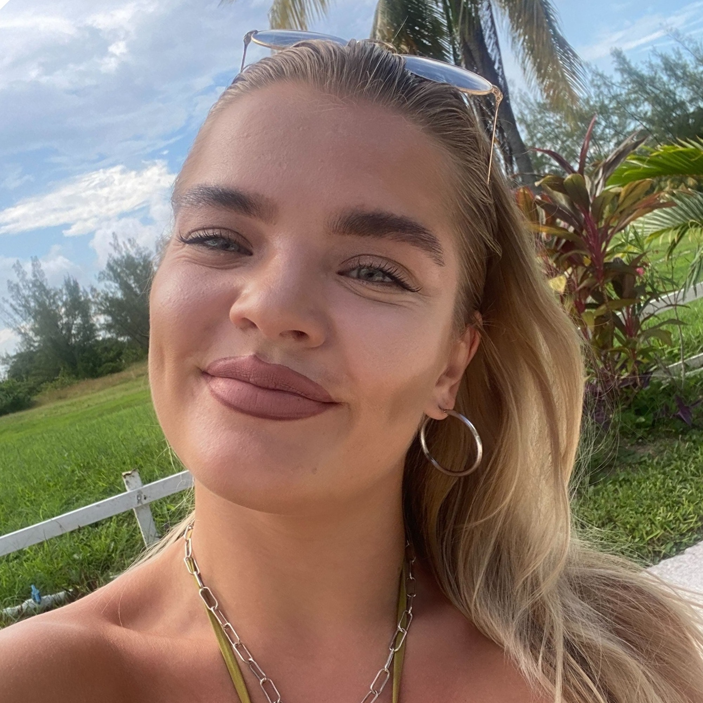
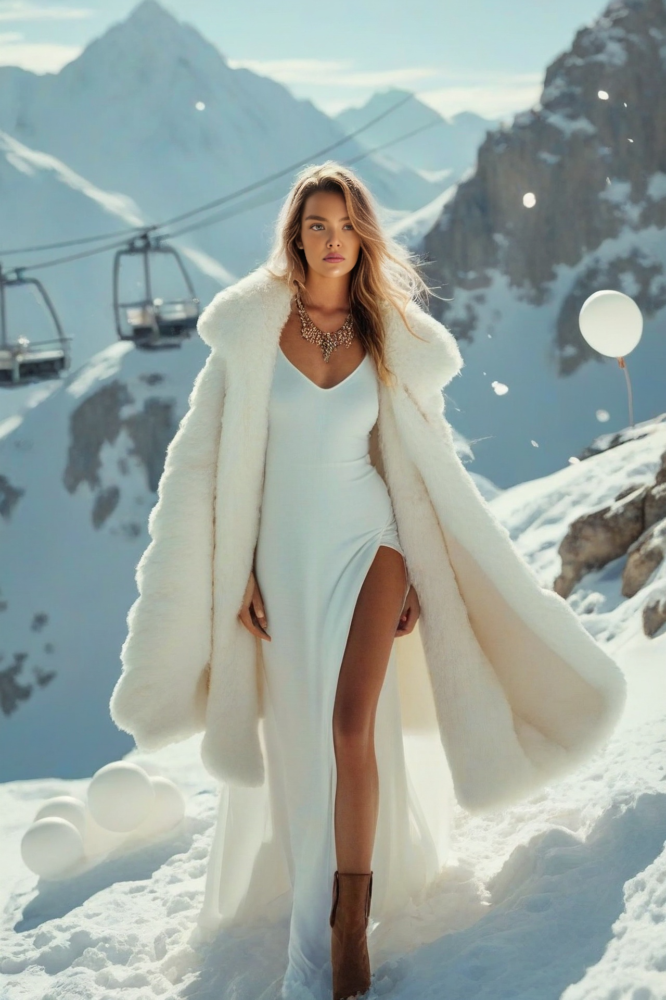

# FaceSwap
| Source Image  | Output Image    |
|---------------|-----------------|
|    |   |
## Installation

Git clone, Create env, install requirements
```bash
git clone https://github.com/ryan-goosling/faceswap.git
cd faceswap
```
```bash
#python3 -m venv venv
#source venv/bin/activate  # Linux/Mac
#venv\Scripts\activate     # Windows
pip install -r requirements.txt
```
Clone face parser
```bash
git clone https://github.com/yakhyo/face-parsing.git
cd face-parsing
pip install -r requirements.txt
```
Load weights
```bash
sh download.sh
```
## Run

```bash
python3 src/infer.py --image_path path/to/your/img.jpg 
```
result image will store at /assets/
or you can with
```bash
streamlit run src/streamlit_app.py 
```

## Architecture overview & Pipeline idea

1. **Data preprocessing**

   - Initially, the provided reference images did not all meet the criteria. One image was discarded due to strong glare on the eyes, bright lipstick, and an overall deviation from the desired style.
   - The remaining images were retouched to reduce the appearance of wrinkles, acne, and bags under the eyes.
   - All images were cropped to a 1024x1024 ratio to ensure consistency and compatibility with the model.

3. **Learning the LoRA model**  
   - The LoRA model was fine-tuned using carefully selected learning parameters, and the results were saved on HuggingFace.
   Check the trained model on HuggingFace: [Glam Person LoRA](https://huggingface.co/biglebowski/glam_person_lora).
   - Fundamental parameters include a small learning rate (`1e-4`) for precise fine-tuning, a resolution of `1024` matching the preprocessed images, and a maximum of `500` training steps to prevent overfitting.
   - Additional parameters like gradient accumulation steps and gradient checkpointing were employed to stabilize training and efficiently manage memory.
   - Training command:
     ```
     #!/usr/bin/env bash
     !accelerate launch train_dreambooth_lora_sdxl.py \
       --pretrained_model_name_or_path="stabilityai/stable-diffusion-xl-base-1.0" \
       --pretrained_vae_model_name_or_path="madebyollin/sdxl-vae-fp16-fix" \
       --dataset_name="data" \
       --output_dir="glam_person_lora" \
       --caption_column="prompt"\
       --mixed_precision="fp16" \
       --instance_prompt="a photo of STRLK person" \
       --resolution=1024 \
       --train_batch_size=1 \
       --gradient_accumulation_steps=1 \
       --gradient_checkpointing \
       --learning_rate=1e-4 \
       --snr_gamma=5.0 \
       --lr_scheduler="constant" \
       --lr_warmup_steps=0 \
       --mixed_precision="fp16" \
       --use_8bit_adam \
       --max_train_steps=500 \
       --checkpointing_steps=717 \
       --seed="0"
     ```

5. **Image processing**
   
   3.1 **Extracting the crop face mask of the input image**  
   - Using BiSeNet model to extract mask we need to crop face to generalise predictoins
   - Pre-prepared masks were generated using the resource: [face-parsing](https://github.com/yakhyo/face-parsing).

   3.2 **Preparation of canny edges for inpainting control**  
   - Canny edge detection is applied to generate control images for the inpainting process.
   - Additionally, the original image is cropped so that the face mask occupies roughly half of the image volume.       - The cropped section is resized to 1024x1024, aligning with the model’s training on profile photographs.

   3.3 **Using a pipeline with preset models**  
   - The pipeline utilizes a `StableDiffusionXLControlNetInpaintPipeline` that integrates a VAE, a ControlNet model, and LoRA weights.
   - This design leverages pretrained models to guide the inpainting process effectively.
   - A balanced set of parameters and prompts is crucial. The positive prompt "STRLK person, cinematic lighting, matte skin, ultra HD" combined with a carefully crafted negative prompt (e.g., "blurry, low quality, low contrast, oversaturated colors, unrealistic plastic skin, gloss, plastic, distorted, bad anatomy, low resolution, noisy") helps filter out undesirable artifacts.
   - Inference parameters such as:
     - `controlnet_conditioning_scale`: 0.5
     - `guidance_scale`: 7.5
     - `num_inference_steps`: 30
     - `strength`: 1.0
     - `inpaint_strength`: 0.9
     - `denoising_strength`: 0.5
     were chosen to strike a balance between detail preservation and smooth inpainting.

6. **Image post-processing**  
   - Although not implemented in the current code, post-processing steps could involve using various refiners to enhance facial aesthetics.
   - Preliminary tests with different refiners did not yield the desired results, indicating that further experimentation is needed for optimal enhancement.


## Example Results

| Target Image                    | Source Image                    | Output Image                    |
|---------------------------------|---------------------------------|---------------------------------|
|     |    |   |
|     |    |   |
|     |    |   |


